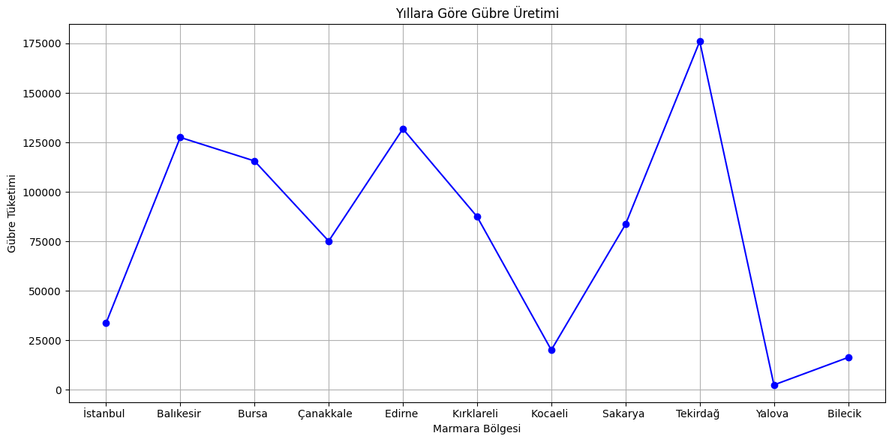
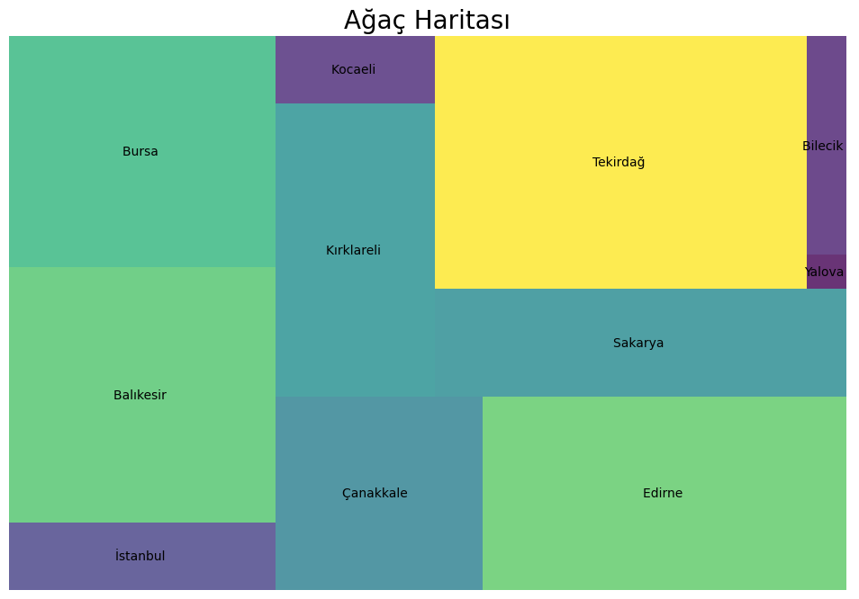
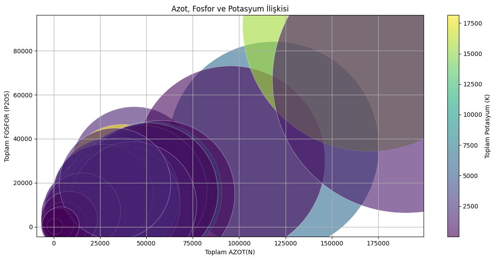
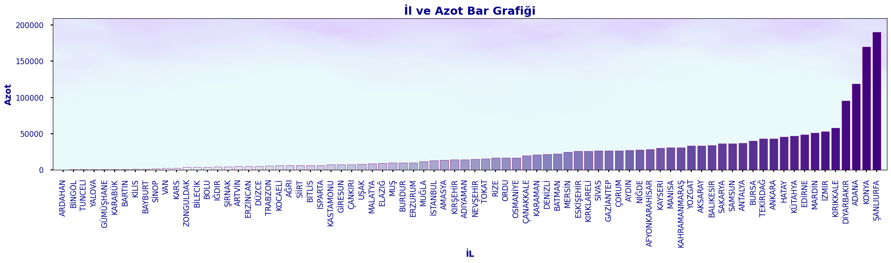

# 📊 Veri Görselleştirme Teknikleri & Tarımsal Veri Analizi

Bu proje, Python'ın veri görselleştirme kütüphanelerini (`matplotlib`, `seaborn`, `squarify`, `wordcloud`) kullanarak Türkiye'nin tarımsal gübre tüketimi ve bitki besin maddesi dağılım verilerini çok boyutlu görselleştirme teknikleriyle inceleyen kapsamlı bir portföy çalışmasıdır.

---

## 🖼️ Projeden Örnek Görseller (Showcase)

| Bölgesel Gübre Tüketim Trendi | Ağaç Haritası (Treemap - Marmara) |
|:---:|:---:|
|  |  |
| **N-P-K Elementleri Balon Grafiği** | **Özel Tasarım Arka Planlı Bar Grafiği** |
|  |  |

---

## 📌 İçerilen Görselleştirme Teknikleri ve Not Defterleri

Projede 17 farklı görselleştirme yöntemi incelenmiş ve grafik çıktıları not defterlerine işlenmiştir:

| # | Görselleştirme Türü | İlgili Not Defteri | Kullanım Amacı / Analiz |
|---|---------------------|--------------------|-------------------------|
| 01 | **Bölgesel Çizgi Grafiği** | [`notebooks/01_bolgesel_gubre_tuketimi.ipynb`](notebooks/01_bolgesel_gubre_tuketimi.ipynb) | 7 coğrafi bölgenin il bazlı gübre tüketim trendleri |
| 02 | **Ağaç Haritası (Treemap)** | [`notebooks/02_agac_haritasi.ipynb`](notebooks/02_agac_haritasi.ipynb) | Marmara bölgesi oransal alan dağılımı |
| 03 | **Balon Grafiği (Bubble Plot)** | [`notebooks/03_balon_grafigi.ipynb`](notebooks/03_balon_grafigi.ipynb) | Azot, Fosfor ve Potas ilişkisi (Çok boyutlu analiz) |
| 04 | **Özel Tasarım Bar Grafiği** | [`notebooks/04_bar_grafigi.ipynb`](notebooks/04_bar_grafigi.ipynb) | Arka plan resim entegrasyonlu il bazlı sıralama |
| 05 | **Alternatif Bar Grafiği** | [`notebooks/05_bar_grafigi_2.ipynb`](notebooks/05_bar_grafigi_2.ipynb) | İllere göre toplam besin maddesi dağılımı |
| 06 | **Çizgi Grafiği (Line Plot)** | [`notebooks/06_cizgi_grafigi.ipynb`](notebooks/06_cizgi_grafigi.ipynb) | Genel besin maddesi tüketim değişimi |
| 07 | **Dağılım Grafiği (Scatter)** | [`notebooks/07_dagilim_grafigi.ipynb`](notebooks/07_dagilim_grafigi.ipynb) | Değişkenler arası ilişki ve saçılım analizi |
| 08 | **Hexbin / Yoğunluk Grafiği** | [`notebooks/08_isi_grafigi.ipynb`](notebooks/08_isi_grafigi.ipynb) | Altıgen ızgaralarla frekans ve yoğunluk tespiti |
| 09 | **Kelime Bulutu (Word Cloud)** | [`notebooks/09_kelime_bulutu.ipynb`](notebooks/09_kelime_bulutu.ipynb) | Metin ve kategori ağırlıklı frekans görselleştirmesi |
| 10 | **Keman Grafiği (Violin Plot)** | [`notebooks/10_keman_grafigi.ipynb`](notebooks/10_keman_grafigi.ipynb) | Olasılık yoğunluğu ve medyan değerleri |
| 11 | **Kutu Grafiği (Box Plot)** | [`notebooks/11_kutu_grafigi.ipynb`](notebooks/11_kutu_grafigi.ipynb) | Kartiller ve aykırı değer (outlier) analizi |
| 12 | **Kümeleme (Clustering)** | [`notebooks/12_kumeleme.ipynb`](notebooks/12_kumeleme.ipynb) | Benzer profil gösteren veri gruplarının kümelenmesi |
| 13 | **Lolipop Grafiği** | [`notebooks/13_lolipop_grafigi.ipynb`](notebooks/13_lolipop_grafigi.ipynb) | Sütun grafiğine minimal ve modern bir alternatif |
| 14 | **Paralel Koordinatlar** | [`notebooks/14_paralel_koordinatlar.ipynb`](notebooks/14_paralel_koordinatlar.ipynb) | Çok boyutlu sayısal öznitelik karşılaştırması |
| 15 | **Pasta Grafiği (Pie Chart)** | [`notebooks/15_pasta_grafigi.ipynb`](notebooks/15_pasta_grafigi.ipynb) | Yüzdesel pay ve oransal kompozisyon dağılımı |
| 16 | **Piramit Grafiği** | [`notebooks/16_piramit_grafigi.ipynb`](notebooks/16_piramit_grafigi.ipynb) | Hiyerarşik ve kademeli sıralama |
| 17 | **Sütun Grafiği** | [`notebooks/17_sutun_grafigi.ipynb`](notebooks/17_sutun_grafigi.ipynb) | Kategorik karşılaştırma ve büyüklük sıralaması |

## 🛠️ Kullanılan Teknolojiler

- **Python 3.x**
- **Veri İşleme:** `pandas`, `numpy`, `openpyxl`
- **Görselleştirme:** `matplotlib`, `seaborn`, `squarify`, `wordcloud`

## 🚀 Kurulum ve İnceleme

Çalışmayı yerel ortamınızda görüntülemek ve çalıştırmak için:

```bash
git clone [https://github.com/kullanici_adi/Veri-Gorsellestirme.git](https://github.com/kullanici_adi/Veri-Gorsellestirme.git)
cd Veri-Gorsellestirme
pip install -r requirements.txt
jupyter notebook
